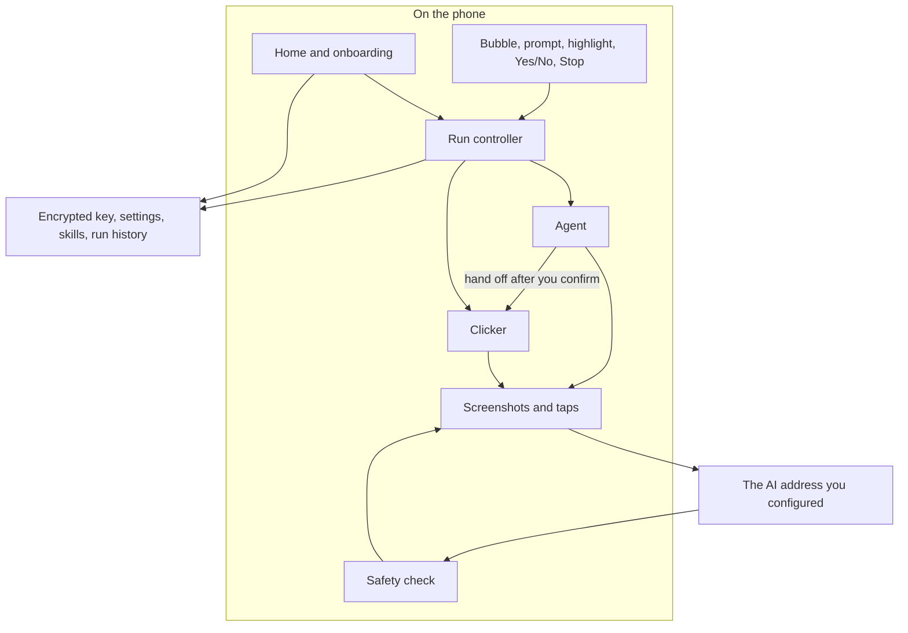
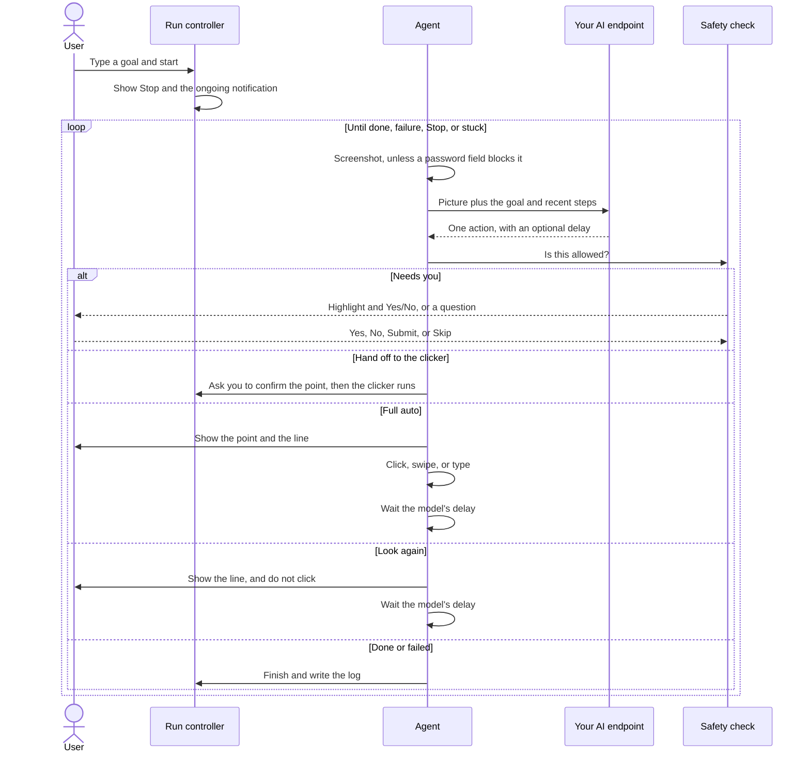
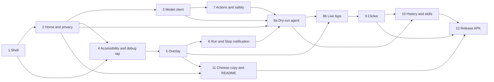

# PromptClick v1 Design Document

| Field | Value |
| --- | --- |
| **Title** | PromptClick: Vision Agent + Coordinate Clicker for Android |
| **Author** | PromptClick design |
| **Date** | 2026-09-03 (requirements rev 4, 2026-09-23; plain-language pass 2026-09-26; full-auto step rhythm 2026-09-26) |
| **Status** | Draft (rev 4) |
| **Product** | PromptClick |
| **Package** | `com.promptclick.app` |
| **Distribution (v1)** | Sideload APK, for the owner and a few friends. Not the Play Store. |

This pass states the same v1 design without source listings. Behavior, limits, and the build order are unchanged.

---

## Overview

PromptClick is an Android app that turns a task you type into taps and swipes on the screen. You turn on an Accessibility Service, then a small bubble floats over whatever app is open, including a full-screen game. The app taps by aiming at a point on the screen. Games and other canvas-style apps do not expose a useful list of buttons, so aiming at a point is the whole method.

Three modes share one click profile: an ordered list of points. Each point is a place on the screen (measured as a fraction of the width and height), a tap count, and a gap between taps.

1. **Manual.** You tap the screen to place one point or a sequence. No model call, and no screenshot leaves the phone.
2. **Semi-auto.** One look at the screen proposes that same profile. You confirm the numbered points. The profile then runs with no further model calls.
3. **Agent.** Full auto: show each step on the screen, do it, then take a screenshot and replan. The model can set the wait before the next look, or look again without tapping. For goals that need a fresh look after each step.

v1 is intentionally thin. You bring your own API key. The agent is a live screenshot, think, act loop. A confirmed repeating clicker handles fight-scene hammering. Stop is always available. Saved skills stay on the phone. There is no PromptClick server, no telemetry of screenshots, no voice, and no marketplace. Screenshots leave the device only for the OpenAI-compatible address you configured. You must accept a privacy notice before the bubble or any screenshot-to-cloud path can start.

Two engines share the floating controls. The agent calls the model between steps. The clicker does not. The agent may hand a confirmed point to the clicker. That split is the product: a menu can wait a few seconds; a fight button cannot.

The app never aims a tap at its own controls. While a tap is being injected, the floating windows ignore touches. Stop sits in a reserved corner, and that corner is not a valid place for the agent or the clicker to tap.

---

## Background and motivation

Phone agents that walk the accessibility tree fail on games, on web views that draw their own canvas, and on any HUD the app paints itself. Those are exactly the surfaces people want to automate: walk a multi-step menu, then mash Attack. Existing auto-clickers make you pick the pixel by hand. Existing model agents are too slow to tap five times a second, and too dangerous to leave alone on a checkout or a login.

PromptClick combines both:

1. A vision-capable model finds the target from a screenshot and can drive a live loop.
2. After you confirm a highlight, a tight tap loop hammers that point about five times a second, with no model in the path.

The repo is greenfield. The workspace contains the app icon `PromptClick.jpeg`: a navy rounded square, a white chevron, and a yellow pointer hand. This document defines the first app: what it does, how the pieces fit, and the order to build it.

Pain this design absorbs up front:

- Games ignore accessibility nodes, so v1 is screenshots and coordinate taps.
- A model call per tap is too slow for combat, so the clicker locks in after one confirm.
- A cloud vision call is a privacy event, so the onboarding acknowledgement comes before the first screenshot upload. The API key is encrypted. There is no PromptClick backend and no screenshot telemetry.
- Our own floating windows would otherwise swallow the taps we inject, so those windows ignore touches during a tap, and Stop owns a reserved corner.
- Phone makers' battery savers kill accessibility services, so a companion notification stays up, we ask for a battery exemption, and the home screen shows a clear recovery state.
- The Play Store is hostile to accessibility automation, so v1 is sideloaded. Store policy is a later risk, not a v1 blocker.

---

## Goals and non-goals

### Goals (v1)

- A sideloadable Kotlin and Jetpack Compose app that runs over games.
- A home screen with your model settings (address, API key, model name), a permission checklist, a bubble toggle, the last run, and a shortcut into Accessibility settings.
- A bubble that can start four things over any app: manual clicks, a semi-auto profile, a live agent, or "find this button" followed by a confirm that starts the clicker.
- Manual clicks: place one or more points, set how many times to hit the last point, play once or repeat. No screenshot leaves the phone.
- Semi-auto: one vision call reads the screen and returns the same kind of profile. You confirm, then the clicker runs it.
- A live agent loop. In full auto, every step is shown on the screen, then performed, then followed by a new screenshot and a new plan. The loop repeats until the model says it is done or it failed, you hit Stop, the loop is stuck, or it hits the step cap.
- The model may set the delay before that next screenshot, from 0 to 10 seconds. If it sets none, the Home pause is used. It may also perform no click and ask for a fresh screenshot, which is how it waits out a loading screen or an animation and then replans.
- While a session is running, each agent step shows one line: the model's short reason, or the action name if it gave no reason. The bubble keeps the latest lines, and Home lists them as steps so far. On a full-auto tap, swipe, or long press, a ring marks the point before the gesture. A session is one run. When it finishes, that session shows the conversation: what you asked, what the model answered, what you confirmed or replied, and how it ended. Every saved session opens the same way.
- The Home pause between agent steps is the default delay. Default one second, anywhere from zero to ten seconds. Zero means no extra wait. It applies to the next step that does not set its own delay, including a run already going. This pause is separate from the clicker interval.
- A repeating clicker after you confirm a highlight. Default 200 ms from the start of one tap to the start of the next. You can set 50 ms to 2 seconds. Tap-count and duration caps apply.
- A big Stop: the floating button, the notification action, and an optional volume-down emergency stop while a run is active.
- A pause for your Yes or No before a purchase, a login or password, and sending a message. Everything else can proceed. Follow-up checkout buttons stay gated.
- Local skills: save a confirmed clicker point, a click profile, or a successful agent trace. No sharing.
- English and Traditional Chinese, following the phone language. You may type the task in any language. No voice.
- An OpenAI-compatible client. SpaceXAI is the default. A custom address, key, and model name lets OpenRouter, OpenAI, or a future local server work without rewriting the client.

### Non-goals (v1)

- A Play Store listing, Play Integrity, or a store-ready accessibility justification flow.
- Shipping or discovering an on-device or LAN model runtime. The client stays address-agnostic. There is no Ollama setup screen.
- Voice or hands-free use.
- A skill marketplace, or sharing a skill by QR code or compressed string.
- Shop search or saving a product listing.
- Kernel hiding, Magisk, memory reads, or any anti-cheat evasion. We automate the UI. We do not hide from the game.
- Multi-display phones and foldables as a first-class target. v1 uses the default display only.
- A screen-capture permission dialog. On Android 11 and newer, the accessibility service takes the screenshot.
- Capturing a single window. v1 always captures the whole default display, so a fraction of the picture is the same fraction of the display.
- Driving ordinary apps from their accessibility tree. Reading window content stays on, for password-field detection and for later, but the v1 planner is vision and coordinates.
- Dragging a highlight to retarget it. Confirm is Yes or No.
- An in-app language picker, and Simplified Chinese resources.

### Later, with a seam left in v1 and no work started

1. A phone agent for ordinary apps, mixing the node tree with vision.
2. A smarter repeating clicker whose interval adapts. A fixed multi-point profile is already a v1 mode. Moving the points when the UI moves is not.
3. Saved recipes that adapt if the UI moved, shared by QR or compressed string.
4. A hands-free or voice helper.
5. Memorizing an ordinary-app task as a shareable skill.
6. Shop search and saving a listing from Chrome or any site.
7. Local models, on device or on the LAN.
8. Fight-scene auto-switch: the agent recognizes a fight and starts the saved clicker skill.

---

## Key decisions

| Decision | Choice | Why |
| --- | --- | --- |
| Package | `com.promptclick.app` | Short, matches the product name, and does not pretend we own a company domain. |
| Minimum Android | 11 (API 30) | Screenshots from an accessibility service start at API 30. Games need screenshots. v1 has no separate screen-capture permission. |
| Target Android | 15 (API 35) | Current stable requested for v1. Foreground-service types exist here. A bump to API 36 can wait. |
| Project shape | One app module, packages split by layer | One sideload APK. The package boundaries are where a later split would happen. |
| UI stack | Kotlin, Jetpack Compose, Material 3, Hilt, coroutines | The home screen is Compose. Logging is planted in the first milestone. |
| Floating windows | Drawn by the accessibility service, with "draw over other apps" as a fallback | Meant to sit on immersive games without a second overlay permission. Phone makers differ. A real-device checklist is the merge bar for the overlay milestone, not an emulator. |
| What the windows are built with | Classic views for the bubble, Stop, the highlight ring, and Yes/No. Compose only for the prompt sheet and the "ask you a question" reply | A Compose view with no lifecycle owner crashes. Classic chrome is also cheaper while taps are passing through. |
| Touches during a tap | Every floating window ignores touches for the duration of an injected gesture. Stop occupies a reserved 64 dp corner. Points in that corner are rejected. The bubble hides while a run is active | Hiding the windows only for the screenshot is not enough. A tap we inject will hit our own windows if they can still be touched. |
| Highlight | Two windows. A full-screen dim and ring that ignores touches, and a small Yes/No panel that can be touched. No "adjust" | A full-screen window that accepts touches would eat the game. There is no platform API that punches a pass-through hole in our window. |
| Screenshot | Always the whole default display, with our windows hidden for one frame | A fraction of the picture then matches a fraction of the display. A single-window capture has different edges, and the tap would miss. |
| Which pixel size we trust | The screenshot buffer's own width and height, recorded before we shrink the image | The size Android reports for "the screen" often omits the navigation bar or a cutout. Taps are aimed in the buffer's pixels. |
| Default vision model | `grok-4.5` | Checked 2026-09-03: it accepts text and images, returns text, supports structured output, and has a large context. Settings mention `grok-4.6` as the faster model you can type instead. |
| Image detail | Low, unless you change it. Choices are low, auto, and high. High is for when you also raise the screenshot's long side to 1080 for a dense HUD | High detail on a modest screenshot costs time and money for little v1 benefit. |
| How we call the model | OpenAI-compatible chat completions, with the screenshot attached as an image | Portable to OpenRouter and OpenAI. The newer Responses API is not the v1 contract. We do not send fields that belong only to that newer API. If the provider rejects the reasoning setting, the next call omits it. |
| Reasoning effort | Low, when the provider accepts the setting | Grok 4.5's own default is high, which is slower than this product wants. |
| What we promise about speed | "A few seconds per step." One to two seconds is a stretch goal, not a guarantee | Public timings for this model on images often land well above that. |
| What the model returns | One flat object: an action name plus optional fields. We check the fields that each action needs. The answer budget starts modest; if a reply is cut off because the model spent it on hidden reasoning, we retry once with a larger budget | A polymorphic schema is fragile across OpenAI-compatible providers. |
| Full auto | Show the step, then act, then screenshot and replan. The model may set a delay of 0–10 seconds before the next screenshot, or return a look-again that does not click | You see the point before it is tapped. The model can wait for the screen to settle, or look again when it is not ready to tap. Purchase, login, send, a clicker handoff, and a question still wait for you. |
| Coordinates | Integers from 0 to 1000, across the full-display image. 0 is the left or top edge. 1000 is the right or bottom edge | The same numbers work on any phone size. We scale them onto the screenshot buffer's real pixels. |
| Clicker speed and caps | 200 ms from the start of one tap to the start of the next. Allowed range 50 ms to 2 seconds. Stop after 500 taps or 2 minutes | The next tap never starts until the previous one has finished. A cancelled tap counts as a failure. The 50 ms setting is labeled best-effort, because the system may be slower. |
| Clicker geometry | Remember the point, the screen size, and the rotation from the moment of confirm. If size or rotation later differs, stop and ask for a new confirm | Quietly re-aiming after a rotation would hammer the wrong pixel, with no model in the loop to notice. |
| Safety | The model can ask for a confirm, and we also check locally. Purchase and send stay gated for the rest of that run. Login is one confirm per password field, so you can finish signing in. Asking the user a question stays. Dragging the highlight does not | Checkout cannot skip the second confirm. A login Yes has to be able to complete. |
| Waiting for you | One state name for every pause: waiting to confirm. Covers safety, clicker lock-in, and a question | One name everywhere, so the UI and the run logic cannot drift. |
| API key | Encrypted preferences, keys in the Android Keystore. If the Keystore fails, we refuse to store the key. The key is not written at all until the secure-store milestone | The library is deprecated. That is accepted for a sideloaded v1. There is no plaintext fallback. |
| Skills | A local database on the phone | Sharing by QR is a later version. |
| Ongoing notification | A companion service, started when a run leaves idle. The accessibility service is not itself the foreground service | The accessibility service is started by the system. Calling the foreground API only from the moment it connects is unreliable on current Android. |
| Volume-down Stop | Optional, on by default, and only while a run is active. We consume both the press and the release. Only one accessibility service on the phone can filter keys | If volume-down never arrives, settings says it is unavailable because another service is filtering keys. The floating Stop and the notification remain the supported paths. |
| Languages | English plus Traditional Chinese, following the phone | No in-app override. Simplified Chinese resources are out of v1. |
| Play Store | Out of v1 | Accessibility-driven automation is hostile on Play. |
| Privacy acknowledgement | Required before the bubble can turn on, and before any screenshot is sent to a model | It cannot wait for the final copy-edit milestone. |

---

## Proposed design

### 1. The shape of the app

The run controller is the only owner of "what is happening now." The agent and the clicker never start themselves from a notification or a floating button. They ask the controller to change state. Stop is guaranteed: every loop pass, and every tap callback, checks a stopped flag before doing more work. If you have not accepted the privacy notice, starting the agent, starting "find button," or enabling the bubble does nothing.

One Gradle module. Layers, and what each is for:

| Layer | Responsibility |
| --- | --- |
| Home UI | Onboarding, permissions, model settings, last run, skills. Jetpack Compose. |
| Floating windows | Bubble, prompt sheet, highlight, Yes/No, questions, Stop. Owned by the accessibility service. |
| Accessibility | Screenshots, taps and swipes, optional volume-down, a small look at the window tree for password and keyword checks. |
| Agent | The live loop, the prompt, reading the model's answer, the stuck detector. |
| Clicker | The fast repeating tap, and the multi-point profile runner. |
| Model client | OpenAI-compatible chat completions. No PromptClick server. |
| Screenshots | Hide our windows for one frame, shrink, compress, map a 0–1000 point onto real pixels, reject the Stop corner. |
| Safety | Decides when to pause for Yes/No. |
| Run lifecycle | States, Stop, the companion notification service. |
| Storage | Encrypted API key, ordinary settings, a local database of skills and run history. |

Tooling for v1: JDK 17, current stable Android Gradle Plugin, Kotlin, and Compose. Hilt for wiring, OkHttp for HTTP, Kotlin serialization, Room for the local database, Timber for logs, and the AndroidX encrypted-preferences library. That library is deprecated; we accept it for a sideloaded v1 and do not build a custom Keystore stack now. Minimum Android 11, target and compile SDK 35. Release builds are minified and resources are shrunk. The upload keystore is never checked in.

The existing `PromptClick.jpeg` artwork becomes the launcher icon (adaptive icon, navy background). The JPEG itself is not the launcher bitmap. v1 does not share files with other apps, so there is no file provider.

### 2. What runs where

| Piece | Role |
| --- | --- |
| Main screen | Settings, onboarding, last run, skill list. A run does not need this screen to stay open. |
| Accessibility service | Screenshots, gestures, the volume-down filter, and the floating windows. It is not the ongoing notification. |
| Run notification service | The "PromptClick is running" notification and its Stop action, while a run is not idle. |
| Overlay controller | Owns every floating window. Created when the accessibility service connects. Torn down when it disconnects or is destroyed. |
| Model calls | Ordinary HTTPS from the phone to the address you typed. |

The engines live for the life of the app process and are shared by the service and the home screen. The accessibility service runs in that same process, so they can share state. If the system kills and restarts the accessibility service, the run comes back idle and does not resume a previous agent or clicker loop. After a phone maker kills us, we do not assume the floating windows are still there. Home turns that checklist row red until the service connects again.

### 3. Permissions

The app asks for:

- Internet and network state, to call the model.
- Notifications, so Stop can live in the shade.
- A foreground service, of the "special use" type, whose stated job is to hold a Stop notification while you asked PromptClick to perform gestures or a confirmed repeating clicker.
- Draw-over-other-apps, as a recommended fallback. The accessibility overlay is the intended path, and this permission is not required when that path works.
- The ability to ask you to ignore battery optimization.

The main screen is the launcher activity. The accessibility service is exported only so the system can bind it, and only the system may bind it. The run-notification service is private to the app.

We do not ask to see all installed packages, to read notifications, to read usage stats, or to vibrate.

Backups are off. The encrypted preferences file is also named in the backup-exclusion rules, so a later backup change cannot sweep the API key up by accident.

HTTPS is the only traffic in v1. A network-security config that says so lands in the release milestone. A user-typed local HTTP address, for a future on-device model, is not enabled in v1.

### 4. Accessibility service

The service is allowed to:

- Perform gestures.
- Take screenshots.
- Read window content, so we can spot a password field, check the label under a tap, and leave a seam for later non-game skills. Games will often return an empty or useless tree. That is expected.
- Listen for hardware keys, so volume-down can Stop a run.

Volume-down rules:

- Only one accessibility service on the phone can filter keys. If TalkBack or another service already does, we never see the key.
- We act on volume-down only while a run is active and the setting is on. Any other key, and volume-down while idle, is left alone.
- When we do handle it, we consume both the press and the release. Consuming only the press still changes the volume. Swallowing the volume change is the intended emergency-stop behavior.
- If the key never arrives, we log that once per session and settings shows: "Volume-down Stop unavailable (another accessibility service is filtering keys)." The floating Stop and the notification still work.

We do not turn on touch-exploration mode. That would break games. We are not a screen reader, and we do not mark the service as an accessibility tool in the store sense.

The description the person reads when enabling the service, in English: "PromptClick looks at your screen and performs taps you confirm so it can carry out the task you typed. It can take screenshots and send them to the AI endpoint you configure. You can Stop at any time."

We listen for window changes so a login pause can re-arm when the screen changes, and we ask for view ids so keyword checks have something to read.

### 5. Floating controls

Many games are immersive and pause if they lose window focus. The overlay flags are a product feature. Sitting an accessibility overlay on an immersive game is phone-maker specific. The merge bar is a named checklist on a physical phone, not an emulator. If the accessibility overlay cannot be added, we retry with the ordinary draw-over-other-apps window when that permission is granted. Otherwise the bubble switch shows that the overlay is blocked.

**Lifecycle.** The overlay controller attaches when the accessibility service connects, using that service's window manager so the windows carry the accessibility token. Detach removes every window, destroys the Compose host used by the prompt sheet, and reports that nothing is attached. Enabling the bubble does nothing unless the service is attached, you have accepted the privacy notice, and accessibility is on. The next time the service connects, windows are rebuilt from saved settings, including where you left the bubble. The engines may outlive the service. They refuse to tap or capture when the overlay is not attached.

**Prompt sheet host.** A Compose view that is not on an activity crashes unless something supplies a lifecycle, saved state, a view-model store, and a back dispatcher. A small host on the prompt sheet does that. It follows the accessibility service: started when the service connects, destroyed when the service unbinds. Back dismisses the sheet or the question panel, the same as tapping outside. The bubble, Stop, the highlight ring, and Yes/No are classic views and do not need this host.

**Each window.** All of them use the accessibility overlay type, with the draw-over fallback above. They are translucent and positioned from the top-left.

| Window | When you see it | Touches | Behavior |
| --- | --- | --- | --- |
| Bubble, about 56 dp | Idle | Only the bubble. Everything else reaches the game | Draggable. Position is remembered. Hidden while a run is active, so Stop is the in-run control. Does not take keyboard focus. |
| Prompt sheet | You opened the bubble | The sheet takes focus so you can type | Sits at the bottom. Keyboard resizes it. We do not set the flag that blocks the keyboard on a focusable window. A game that pauses on focus loss may pause while you type. That is acceptable, because you are typing, not mid-fight. Back or a tap outside dismisses the sheet, hides the keyboard, and returns the game to normal. Contents: the prompt, Start agent, Find button, and the last three prompts. |
| Dim and ring | Waiting for Yes/No on a point | None. The game receives every touch through this layer | Full screen. A light dim and a ring about 48 dp across the proposed point. |
| Step ring | A full-auto tap, long press, swipe, or type | None. The ring ignores touches, so the gesture lands on the game | The same ring, with no dim and no Yes/No. It marks the point before the gesture (the start and the end, for a swipe) and stays up through the gesture and the delay. Hidden for the one frame of the next screenshot. A look-again step shows the one-line reason and no ring. |
| Yes/No | Same moment | Only the small panel | Does not cover the target. Yes and No only. No drag-to-adjust. |
| Question | The model asked you something | The panel, and the keyboard | Same keyboard behavior as the prompt sheet. Question, reply field, Submit, Skip. |
| Stop, at least 48 dp | Any run that is not idle | Only the Stop button | A reserved 64 dp corner. Default is the top end, opposite where the bubble last sat. You cannot drag it into the other reserved corner. High contrast. Does not go through the model. |

**While a tap is in flight.** An injected tap is a real touch. A visible, touchable window at that pixel will receive it. Hiding windows for the screenshot does not solve this.

Every injected gesture is wrapped: mark every floating window so it cannot be touched, perform the gesture, then restore the windows that belong to the current state. Stop stays visible to you between taps. It cannot be hit by a tap we inject.

| What is happening | What is on screen | What you can touch, between taps | During an injected tap |
| --- | --- | --- | --- |
| Idle | Bubble | The bubble | No tap in progress |
| Agent running | Stop, plus the step ring and the one-line reason while a full-auto step is showing | Stop. The ring ignores touches | Every window ignores touches |
| Clicker running | Stop | Stop | Every window ignores touches |
| Waiting on safety or clicker confirm | Dim and ring, Yes/No, Stop | The panel and Stop | No tap until Yes |
| Waiting on a question | Question panel and Stop | The panel and Stop | No tap |
| Finished | Nothing extra, then back to idle | — | No tap in progress |

The reserved corner is a second defense. It is a 64 dp square in Stop's corner, plus the bubble's own bounds when the bubble is visible. A 0–1000 point that lands in that inset is rejected. The agent fails that step and tells the model. A clicker lock-in is refused, and we ask you to find the button again. Tests that tap "the center" use the display center, which must not be the reserved corner.

Three manual checks, spread across the overlay, run-lifecycle, and live-agent milestones:

1. A test tap on Stop's own pixel must not press Stop.
2. A test tap on a game control that sits under where the bubble was (the bubble is hidden during a run) must hit the game.
3. With the highlight up, taps outside the Yes/No panel must reach the game.

### 6. Screenshots and where a tap lands

v1 has one capture path. The picture is the whole default display. A fraction of the picture is the same fraction of the display.

```mermaid
flowchart LR
  Hide["Hide our windows"] --> Frame["Wait one frame"]
  Frame --> Shot["Screenshot the whole display"]
  Shot --> Size["Remember the buffer's real pixel size"]
  Size --> Show["Show our windows again"]
  Show --> Shrink["Shrink, longest side 768"]
  Shrink --> Jpeg["JPEG, then send"]
  Jpeg --> Model["Model returns 0 to 1000"]
  Model --> Aim["Scale onto the real pixel size"]
  Aim --> Corner["Reject the Stop corner"]
  Corner --> Tap["Tap that pixel"]
```

**Capture**

1. Hide every floating window. Do not detach them. Hiding is cheaper, and the window token stays.
2. Wait one frame.
3. Screenshot the default display, on every Android version v1 supports. A single-window screenshot is a different rectangle, and scaling a fraction of that picture onto the full display would miss.
4. Show the windows again after the bitmap is copied, and before the model call. Later taps use the "ignore touches" wrap, not a second hide, so you can still see Stop between taps.
5. Read the screenshot buffer's width and height before shrinking, then release the buffer. Those pixels are what gestures use.
6. If Android says we screenshot too soon (about three times a second is the limit), wait and try once.
7. A single dark frame is not, by itself, a protected screen. Games fade, load, and splash. Hiding our overlay for one frame can also darken a capture.

A frame is near-black when more than 98% of its pixels are crushed black (each color channel under 8). It has chrome when any pixel is brighter than that: a status bar, a HUD, a letterbox edge, anything.

On a near-black frame, or if Android reports a secure-window error, wait about a third of a second and capture once more. That wait also covers the screenshot throttle. The secure-window error is documented for window captures and may never show up on a full-display capture. We still handle it if it does.

After that retry:

- The secure-window error is still there. End the run. The screen is blocked.
- Still near-black, and no chrome. End the run. This is a true protected full-screen app, such as some banking or video apps.
- The retry is usable. Use it.
- Still near-black, but something brighter is visible. Skip the step: wait about 400 ms, do not call the model, and do not count it as the model tapping the same place again. Five skips in a row end the run, so a black loading screen cannot spin forever.

Hiding our overlay for one frame is not, by itself, a reason to treat the screen as protected.

**Compression**

- Longest side 768 pixels. You can pick 720, 768, or 1080. Keep the aspect ratio. Do not letterbox.
- JPEG quality 70. If the file is over 500 KB, drop quality to 50, then 40.
- Do not save the JPEG. The bytes exist only for the call in flight. A debug switch can keep the last one. It is off.

**Aiming**

The model is told: the image is a screenshot of the entire display, after scaling. Return x and y from 0 to 1000. 0 is the left or top of this image, and therefore of the display. 1000 is the right or bottom.

We scale those numbers onto the screenshot buffer's real width and height, not onto the shrunk JPEG, and not onto the screen size Android reports for layout. The reported size, on Android 11 through 15, often omits the navigation bar or a cutout, so a 1080×2200 "screen" can sit on a 1080×2400 buffer. Aiming from the smaller number either rejects every step or hits the wrong pixel.

The buffer size is the source of truth, because gestures are in those full-display pixels. We may log the window manager's maximum bounds or the display's real size when they disagree. We still aim from the buffer.

The shrunk image keeps the same proportions as the buffer, because we scale uniformly and do not crop. Status bar, navigation bar, and cutout are in the picture. The model taps what it sees. If the proportions do not match, the step fails. We do not guess.

The clicker stores the 0–1000 point, the buffer size, the real display size, the rotation, and the density from the confirm. Aiming uses the stored buffer size. The clicker does not take a new screenshot. Every tap, and every replay, compares the current rotation and the current real display size with what we stored at confirm. Real size means the full display, including system bars, not the smaller layout size. If rotation or real size differs, we stop and require a new find-button confirm. We do not quietly re-aim. We also do not compare the buffer height with the layout height. That mismatch is permanent on phones with a navigation bar, and it would abort every tap. The accessibility service listens for display and configuration changes.

**Cost and time, per agent step**

Assumptions: a 768-long-side JPEG around 80 KB; Grok 4.5 input at $2 per million tokens and output at $6 per million; the image billed as input; low reasoning effort; low image detail.

| Item | Estimate |
| --- | --- |
| Uploading ~80 KB on Wi-Fi or good LTE | 80–300 ms |
| Image tokens at low detail | about 85–400 input tokens |
| Instructions, the goal, and recent actions | about 800–1500 tokens |
| The JSON answer | about 80–250 tokens |
| Reasoning tokens at low effort | highly variable; budget 500–2000 |
| Dollars per step | about $0.003–0.012 typical; worse if effort or detail is high |
| Capture and compress | 50–150 ms |
| Model round trip | Honest range: 2–8 seconds typical, 8–15 seconds at the slow end, on this model with images. 1–2 seconds is a stretch, not the plan |
| The gesture itself | 50–80 ms |
| What we tell the user | A few seconds per step. The call times out at 30 seconds. One retry if the answer cannot be read |
| A 15-step menu | about $0.05–0.20, often one to three minutes |
| The clicker, after you confirm | No further model cost. Taps every 200 ms, start to start |

The home screen says: "Each think step sends one screenshot and takes a few seconds." We do not phone home to measure this.

### 7. Calling the model

The client sends one chat-completions request. Configuration:

- Address, default `https://api.x.ai/v1`, with any trailing slash removed.
- API key, read from encrypted storage, never logged.
- Model name, default `grok-4.5`.
- Timeout, 30 seconds.
- Reasoning effort, default low. Omit it if this provider rejects it.
- Image detail: low, auto, or high. Default low.
- Prefer a strict JSON schema. If the provider returns a bad request, fall back to "any JSON object," and remember which mode worked for this address and model.
- A modest answer budget. If the reply is cut off because the model spent the budget on hidden reasoning, retry once with a larger budget.

The call itself:

- One shared HTTP client. No interceptor logs the body.
- Authorization is a bearer token. The body is JSON.
- When there is an image, the user message contains the JPEG as a data URL plus the text. Detail follows the setting above.
- Do not send fields that belong to the newer Responses API. Sending them is a likely bad request.
- If the answer comes back wrapped in a markdown fence, strip the fence before reading it.
- A bad key or a forbidden response is not retried. Rate limit and server errors retry once, after one second.

Settings show the address, a masked API key, and the model, with helper text: "Vision-capable. Default grok-4.5; grok-4.6 is typically faster." Image detail and reasoning effort sit in advanced settings, plus a Test connection button.

Test connection in a release build is a tiny text-only ping. It does not take a screenshot. A debug build can also send a one-pixel JPEG and expect a small "done" answer, which proves this model accepts images.

Chat completions plus an image URL is the v1 contract because it is portable. The Responses API can be revisited later.

### 8. What the model can do

The model returns one flat object, not a menu of different shapes. We turn that object into a typed action only after the required fields check out.

| Action | What it needs | Notes |
| --- | --- | --- |
| Tap | x, y | Short press. Default about 50 ms, clamped to a small range. Optional delay before the next screenshot |
| Long press | x, y | Default about 600 ms, clamped between 400 ms and 1 second. Optional delay before the next screenshot |
| Swipe | x, y and a second point | Default about 250 ms, clamped between 150 ms and 600 ms. Optional delay before the next screenshot |
| Look again (`wait`) | nothing | No click. After the delay, take a fresh screenshot and replan. Any point on this answer is discarded |
| Type | the text | x, y optional. If present, we show that point and tap there first to focus. Optional delay before the next screenshot |
| Needs confirm | a reason and a safety class | x, y should be present. If they are missing, Yes does not tap |
| Start clicker | x, y | Interval optional, clamped to 50 ms–2 seconds |
| Ask the user | a question | No coordinates |
| Done or fail | a reason | Ends the run |

Safety class is one of: purchase, login, send a message, or other.

Any action may include a delay, a whole number of milliseconds from 0 to 10 seconds. That is the gap after the step is shown and performed, before the next screenshot. If the model leaves it out, the Home pause is used. On a look-again, that delay is the whole step: show the line, click nothing, wait, screenshot, replan. An older look-again answer that sends its wait in the duration field is treated as this same delay. The two are not added together. The delay is separate from how long a finger is held down, and separate from the clicker interval.

An unknown action, a missing required field, or a coordinate outside 0–1000 is a bad answer. We retry exactly once: a second call with no new image, telling the model to return only the JSON object, and giving it the raw text it just produced. If that is still unreadable, the run fails.

Asking the user is in v1. Dragging the highlight to retarget is not.

### 9. The agent loop

Starting the agent is ignored if you have not accepted the privacy notice, or if the floating windows are not attached. Stop cancels the work.

**Full auto** is every agent step that does not need you. Purchase, login, send, a clicker handoff, and a question still wait. Every other step is shown, then either performed or skipped, then followed by a new screenshot and a new plan.

The session opens with a screenshot, so the first plan has a step to show. After that, each full-auto step follows the same rhythm.

1. Stop if you asked, if we hit 40 steps, if the stuck detector fires, or if the overlay is gone. A look-again counts as a step.
2. If a password field is focused, follow the login rules in the safety section. That can skip the screenshot.
3. Otherwise capture and compress, with our windows hidden for one frame. This picture is what the model plans from.
4. Build the prompt: the goal, the last eight actions, the last failure, the image size, the safety rules, and the shape of a valid answer.
5. Call the model, with the image, or text-only when a screenshot was withheld.
6. Parse the answer. Run the safety check against the smallest element under that point, any class that is already sticky, the login exception, and the goal.
7. If the step needs you, wait. The confirm ring and Yes/No, or the question, stay up until you answer. A Yes that includes a point performs that one tap, then uses the delay below. The next pass then screenshots and replans.
8. If the model returned a tap, long press, swipe, or type, show it and then do it. The ring marks the point, and the one-line reason shows on the overlay. Then perform the gesture. Record the step. Do not record images.
9. If the model returned look-again, show the line and perform no click. Record the step. Do not record images.
10. Wait the delay the model set for this step, from 0 to 10 seconds. If it set none, wait the Home pause, which defaults to one second and uses the same range. Read that Home value at the start of the wait, so a change applies to the next step that does not carry its own delay. Android already throttles screenshots to about three a second. This wait is only the gap before the next screenshot. Model time is extra, and the clicker interval is a different clock.
11. The next pass takes the screenshot and the model replans the following step from it.

Stuck means any of these: three taps whose points are all within a small neighborhood of each other (about 12 units on the 0–1000 scale, not raw pixels); three unreadable answers in a row; or the identical answer twice after we told the model nothing visible changed. The run then fails as stuck.

Done or fail moves the run to finished, then back to idle once the UI has consumed the result. Starting again is ignored unless the run is idle or already finished. Handing off to the clicker is not "done."

While a session is running, each step records one short line for the bubble and for Home: the model's reason, or the action name if it gave no reason. A step that produced no action records the error instead. The bubble shows the current line plus up to six earlier lines. Home lists those lines under "Steps so far."

When the session finishes, its page is the conversation, in order. Screenshots stay out of it.

| Turn | What you see |
| --- | --- |
| You | The goal you typed. A manual session opens with "Manual clicks," because there was no prompt. |
| Model | One turn per think step: its reason, or the action name. A delay it set, and a look-again with no click, are part of that line. Semi-auto is a single turn describing the profile it proposed. |
| You | Yes, No, Skip, or the reply you typed, written at the moment you were asked. |
| Clicker | If the clicker or a profile ran, one line for that stretch: how many taps, and why it stopped. The individual hammer-taps stay inside that one line. |
| End | Done, failed, or stopped, with the reason. |

Each of the last 50 sessions keeps its own transcript. Opening any finished session shows that conversation. The newest one is the last-run row on Home.

### 10. What we tell the model

The system instructions stay in English. They are not translated with the UI. Your goal is passed through as you typed it.

The instructions say:

- Return one JSON object per screenshot, using the action list above. Plan only the next step. After it is shown, and either performed or skipped as a look-again, the following message is a new screenshot of the result.
- Coordinates are 0–1000 on the full-display image. The origin is the top left.
- You may set a delay from 0 to 10000 milliseconds. We wait that long after the step before taking the next screenshot. Leave it out to use the person's default pause.
- If you are not ready to tap, return a look-again (`wait`) with a delay and no point. Nothing is clicked. We wait, take a new screenshot, and ask you to plan again. Use this when the screen is loading or still moving.
- Prefer the fewest actions. If the goal is already true, say done.
- If you cannot see a way forward, fail with a short reason.
- If the next tap would purchase, submit a payment, confirm an order, focus or submit a password, sign in, or send a message, ask for a confirm. Include the safety class and the point of the control. Never type into a password field.
- A combat or attack button that should be hit repeatedly is a clicker handoff, not a single tap.
- Avoid the PromptClick Stop corner and, where you can, system navigation.
- Ask the user when a real ambiguity needs an answer. Do not guess.
- Recent actions and any error we report are facts. Those errors include "that point is our own button," "typing is not possible here," and "the screen size or rotation changed."

Each step also sends: the goal, the scaled image size, the real display size, density, and rotation, the step number and the cap, the recent actions, the last error if any, and whether purchase or send is still gated for this run.

### 11. Performing a gesture

Taps and swipes go through the accessibility service, inside the "ignore our windows" wrap. We never start a second gesture until the previous one has completed or been cancelled. If Stop is set, or the overlay is gone, we do not dispatch.

| Action | What happens |
| --- | --- |
| Tap | A short stroke on one point, about 50 ms, or the model's duration clamped between 30 ms and 200 ms |
| Long press | The same point, held between 400 ms and 1 second |
| Swipe | A stroke from the first point to the second, between 150 ms and 600 ms |
| Look again | Show the line. No gesture. After the delay, the next pass screenshots and replans |
| Type | See below |

Typing:

1. If the model gave a point, tap there first and wait about 300 ms for focus.
2. If the focused field can take a set-text action, use it.
3. Otherwise paste from the clipboard if the field supports paste, then clear the clipboard.
4. Otherwise report that typing is not supported here.

Games usually have no field and no keyboard we can drive. The UI says: "Typing into games is often impossible; PromptClick can only tap on-screen keys it can see."

### 12. The repeating clicker

The interval is measured from the start of one tap to the start of the next. After a tap finishes, we wait whatever remains of the interval. We never queue the next tap early. Android cancels a stroke if you dispatch another one on top of it. A cancelled tap counts as a failure. Five failures in a row stop the clicker.

- Default interval 200 ms, about five taps a second when the stroke itself is shorter than that. You can set 50 ms to 2 seconds. The 50 ms label says the system may be slower.
- Default cap 500 taps or 2 minutes. If you turn on "run until Stop," the hard cap becomes 10,000 taps or 30 minutes.
- No model, no screenshot, and no extra safety check on each tap. You already confirmed.
- Each tap still marks our windows as untouchable, so Stop is not pressed by the clicker.
- If the real display size or the rotation changes, we stop and ask you to find the button again. We do not quietly re-aim.

Two ways in:

- The agent proposes a clicker point. We reject it if it sits in the Stop corner or the display has already changed since the look. We show the ring and Yes/No. Yes starts the clicker with the saved geometry.
- You choose Find button on the bubble. That is a short agent goal whose useful result is the same handoff.

The loop then taps until Stop, the tap cap, the time cap, or a display change.

A single repeating point always comes from a confirmed highlight or a confirmed handoff. After a successful clicker run, we offer to save it as a clicker skill, including the rotation. A sequence of points is a click profile, described next. The single-point clicker stays as it is.

### 13. Click profiles, manual and semi-auto

One profile is the shared artifact. Manual mode fills it from your taps. Semi-auto fills it from one vision read. Both then run on the profile player: no model and no screenshot per tap.

A profile is an ordered list of at most 12 steps. Each step is a 0–1000 point, a tap count from 1 to 100, a start-to-start interval from 50 ms to 2 seconds, and an optional label of up to 40 characters. Playing once runs the list a single time. Repeat runs it until Stop, the tap cap, or the time cap. Screen size and rotation are frozen at confirm. Replay stops if the display has changed. A point that lands in the reserved Stop corner is dropped. If none remain, the run does not start.

**Manual.** From the bubble: Manual clicks. No prompt and no API key. A full-screen editor records each tap as the next point. You set the tap count on the last point (the stepper goes from 1 to 50), one interval for the sequence, and play-once or repeat. Undo and Clear edit the list. Start runs immediately. Cancel closes the editor. Nothing is uploaded.

**Semi-auto.** From the bubble: Semi-auto. The prompt may be empty. An empty prompt means "read this screen and propose the click steps for the obvious primary action, in order." One screenshot goes to the address you configured. The model returns a name, whether to loop, and the steps, each with a point, a tap count, an interval, and a label, in the same 0–1000 space. We show numbered rings and Yes/No. Yes runs the profile with no further model calls. No, an empty step list, or an unreadable reply ends the run without tapping. The privacy acknowledgement and an API key are required, the same as the live agent.

After either run, Home offers to save the click profile. Replay asks once, then runs the saved profile.

### 14. Safety pauses

A safety pause does not finish the run. The run waits for you. Every such wait uses the same state, whether it is a safety confirm, a clicker lock-in, or a question.

**What Yes, No, Submit, and Skip do**

- A confirm that includes a point, whether the model asked or our own check did: one tap at that point, then the loop continues. Yes creates that tap.
- A confirm with no point: no tap. The loop continues so the model can try again, knowing you approved the situation.
- A clicker handoff: Yes starts the clicker. It is not a single tap.
- A question: Submit adds the question and your answer to the recent history. Skip tells the model you skipped. No gesture either way.

**Purchase and send stay gated.** After you say Yes to a purchase or a send, that class stays on the run until it finishes, fails, or you Stop. While it is on, every later tap, long press, swipe, or type waits for you again, under that class. A new class from the model or from our own check is included too. Saying Yes does not pre-approve the next button. A checkout cannot skip "Confirm order."

**Login is one confirm per password field.** It is not sticky for the rest of the run, because after Yes you may still need to type the password and continue in the app.

- If the focused field is a password field and we have not already asked about this field on this window: do not take a screenshot. Ask once.
- Yes still performs the one tap if we have a point. No does not tap.
- Either answer remembers this field, so we do not ask again while it stays focused.
- We forget that memory when the window changes, or when focus is no longer a password field. A new login screen can pause again.
- While the same password field stays focused, we do not raise another login confirm, and we drop a model answer that tries to. We do not screenshot, because the password may be on screen.
- After Yes: wait for the window or the focus to change, up to 30 seconds. You can Stop. When it changes, the loop continues and can screenshot again if the field is gone. If it is still the same password field when the wait ends, we ask "Finished signing in?" with no screenshot. Submit checks again. Skip fails the run as a login that did not resolve.
- After No: the run fails immediately, because you rejected the safety pause. We do not ask again, and we do not send the model a picture of the password screen.
- If the loop does take a model step while that same field is still focused, the step is text-only. The model is told the screenshot was withheld because a password field is still focused. It may wait, finish, fail, or ask you something. It may not raise the same login confirm again.

The automated test for this: after Yes on a login, a second loop pass with the same password field focused does not open another confirm until the window changes.

**How we decide a point looks sensitive.** A tap has no words of its own, so we look at the screen tree. Among the visible elements whose bounds contain the point, we take the smallest one. The largest one is almost always the whole window, and keyword checks on it are useless. If nothing contains the point, we have no element. We then read the text, the content description, and the view id on that element and on its direct parent.

Any one of these is enough. We look at the focused field, at the element under the point plus its parent, and at the window title.

- The field is marked as a password, or its input type is a password.
- Login words, ignoring case, in English and Traditional Chinese: password, 密碼, 口令.
- Purchase words: buy now, purchase, checkout, place order, a pay-amount phrase, add card, 確認購買, 結帳, 付款.
- Send: the element looks like send (send, 發送, 傳送) and the same element or its parent looks like a message (message, 訊息, 聊天, sms, email, mail).

"Nearby" means that same element or its direct parent. It is not a search across a wide area of text.

**When we screenshot.** A password field seen before capture, and not already covered by the one-confirm memory, skips the capture and asks once. After Yes or No, capture stays off until the window or the focus leaves that field. Games and custom web views with no tree still get screenshotted. Onboarding says so. v1 has no on-device text recognition.

The safety tests use a fake tree, not a live accessibility node, and cover the smallest-element pick, parent keywords, sticky purchase, and the login one-confirm rule, including No ending the run.

### 15. Stop

Stop is safe to call more than once.

1. Set the stopped flag first.
2. Cancel the agent and the clicker.
3. A tap already in flight may finish. Nothing new is queued.
4. Remove the highlight windows. Restore the idle bubble if the overlay is still attached.
5. Drop the ongoing notification and stop that service.
6. Write the run log as stopped. Move through finished, then back to idle.

You can Stop from the floating button, the notification, volume-down when it is delivered, the home screen, or because the accessibility service was unbound or destroyed.

A model reply that arrives after cancel is ignored.

### 16. Staying alive

The ongoing notification is a companion service. It is not the accessibility service.

When a run leaves idle, the accessibility service starts that companion. The companion must post its notification immediately, inside the short window Android allows, or the system will treat it as stuck. The notification service does not ask to be restarted. If Android does restart it and no run is active, it removes the notification and stops. It never resumes a run on its own. Returning to idle removes the notification and stops the service. The accessibility service does not post this notification at the moment it connects.

The notification title is "PromptClick is running," with a shortened goal, a Stop action, and it stays ongoing.

Home offers a battery-exemption prompt, plus short hints for Xiaomi, Redmi, POCO, Huawei, Honor, Oppo, Vivo, and Samsung.

The notification is up whenever the agent is running, the clicker is running, or we are waiting for you.

### 17. Home, onboarding, and languages

Home is one scrollable Material 3 screen.

1. Onboarding and the privacy acknowledgement, full screen until you accept. The bubble and the agent do nothing without it.
2. Permission checklist: Accessibility, notifications on Android 13 and newer, overlay when the fallback is needed or was denied, and battery exemption. There is no screen-capture-permission row.
3. Model settings: address, API key, model name (the helper mentions grok-4.6), Test connection, image detail, and reasoning effort under advanced.
4. Bubble enable. It does nothing until accessibility is connected and you have accepted the notice.
5. Sessions. The newest finished session is on Home and opens its conversation. The same list holds older sessions, up to the 50 we keep, and each opens its own conversation.
6. Skills.
7. Clicker defaults, the default pause between agent steps (used when the model does not set a delay), the volume-down Stop toggle (and the unavailable hint), and the screenshot's longest side.
8. While a session is running, "Steps so far" lists one line per agent step. When it finishes, that session shows the conversation instead.

**Privacy copy.** Shown once, full screen. Acceptance is stored with ordinary settings.

- PromptClick captures screenshots of whatever is on the display, including games and other apps, when a run uses the live agent or semi-auto.
- Manual clicks do not send a screenshot. Semi-auto sends one screenshot to build a click profile, then taps with no further model calls. The live agent sends a screenshot each step.
- Those images go to the API address you enter. The default is SpaceXAI. PromptClick does not run a backend and does not upload screenshots to us.
- Do not use it on screens you would not send to that provider.
- Login, purchase, and send pause for your Yes.
- You can Stop at any time, from the overlay, the notification, or volume-down.
- A game's terms or anti-cheat may forbid automation. That risk is yours.

The checkbox is required before the bubble can start and before the agent sends an image. This gate ships with the home-screen milestone, not with the final copy pass.

**Languages.** English and Traditional Chinese resource files. The phone's language wins. There is no in-app override. Prompts to the model stay in English. Your goal is sent as typed. The safety keywords include both languages. There is no Simplified Chinese file. A phone set to Simplified Chinese sees English, which is how Android resolves resources.

### 18. Left for later

| Future idea | Seam we leave now |
| --- | --- |
| A local or LAN model | The client already takes an address. Cleartext HTTP would be a later opt-in. |
| Voice | The prompt sheet is the only way to start a task. |
| Sharing a skill by QR | A skill is already a saved document with a type and a payload. |
| Planning from the window tree | We already wrap nodes and can find the smallest element under a point. v1's planner stays vision. |
| Auto-switching into a fight clicker | The "please confirm this clicker point" handoff already exists. |
| Screenshot of one window | Would need that window's bounds in the mapping. Not v1. |
| Play Store | We do not mark ourselves as an accessibility tool. A later document would cover store policy. |

### 19. Numbers to remember

| Thing | Value |
| --- | --- |
| Delay before the next screenshot | The model may set 0–10 seconds on the step. If it does not, the Home pause applies: 1 second default, same 0–10 second range |
| Agent step cap | 40 |
| Model timeout | 30 seconds, then one repair attempt if the answer cannot be read |
| Clicker interval | 200 ms default, 50 ms to 2 seconds, start to start |
| Clicker caps | 500 taps or 2 minutes. "Until I stop" raises this to 10,000 taps or 30 minutes |
| Clicker failures | 5 cancelled or failed taps in a row ends it |
| Profile length | At most 12 points, 1 to 100 taps each. The manual stepper edits the last point from 1 to 50 |
| Screenshot long side | 768 px default. Choices: 720, 768, 1080 |
| JPEG | Quality 70, under 500 KB, then quality 50 and 40 |
| Stuck taps | Three taps within about 12 units on the 0–1000 scale |
| Recent actions sent to the model | The last 8 |
| Lines kept on the bubble | The current line plus 6 earlier |
| Run history kept | The last 50 |
| Reserved Stop corner | 64 dp |
| Login wait | 30 seconds, then "Finished signing in?" |
| Dark-frame skips | 5 in a row ends the run |

---

## How a run moves

The run controller exposes the current state, and these requests:

| Request | What it does |
| --- | --- |
| Start agent | Ignored unless the run is idle or finished, you accepted the notice, and the overlay is attached |
| Find button | Same gate. A short goal whose useful result is a clicker confirm |
| Lock the clicker | Moves to waiting for Yes/No on that point |
| Confirm | Yes, or Submit on a question. An optional answer string for the question |
| Reject | No, or Skip |
| Window changed | Forgets the login one-confirm memory when the window id changes |
| Stop | The path in the Stop section |

States:

| State | Meaning |
| --- | --- |
| Idle | Nothing running. The bubble can show |
| Agent running | The goal and the current step number |
| Waiting to confirm | Why we are waiting (safety, clicker lock-in, or a question), and the point in both 0–1000 and raw pixels when we have one |
| Clicker running | How many taps, and how long it has been going |
| Finished | The result. Returns to idle when the UI has consumed it, or when the next start is requested |

A clicker target remembers the 0–1000 point, the interval, the screenshot buffer size (what we aim with), the real display size (what we compare later), and the rotation.

The screenshot capability returns the full-display bitmap plus the sizes, density, and rotation described above. Gestures are tap, swipe, and type. The overlay controller can attach, detach, mark every window untouchable, and restore the flags that match the current state.

**Notification actions.** Stop, and tapping the notification body to open the app. Debug builds also have a "tap the center" action.

**Settings shortcuts from Home.** Accessibility settings, draw-over-other-apps, battery optimization, and this app's notification settings.

---

## What the phone stores

No server schema. Everything is local.

### The API key

File name `promptclick_secure`, via encrypted preferences. The encryption key lives in the Android Keystore. Preference names are encrypted one way, values another, which is the library's standard pair.

The home-screen milestone must not write the API key. Until the secure-store milestone, the field is only on-screen state and disappears if the process dies. That is acceptable for that milestone.

If creating the encrypted store throws a keystore or IO error, which some phone firmware does, we fail closed. Home shows that the API key cannot be stored on this device. We do not write the key into ordinary preferences. The agent stays blocked.

The library is deprecated. We accept that for a sideloaded v1 and do not invent a replacement now.

Stored here: the API key, the base address, and the model name. Never logged. Never backed up. Backups are already off, and the backup rules also exclude this file from cloud backup and from device-to-device transfer.

### Ordinary settings

Bubble on or off, bubble position, clicker interval and caps, the default pause between agent steps, volume-down Stop, screenshot long side, image detail, reasoning effort, the privacy acknowledgement, onboarding completed, and which JSON mode worked for the current provider. Not the API key.

### Run history and skills

A small local database.

A run record stores when it started and ended, the goal, the status (done, failed, or stopped), the step count, an error string if any, and the conversation as text: each turn, who spoke, and when. No images. That transcript is what opening a finished session shows.

A skill stores an id, a name, when it was created, a type, and a payload. Types are a single clicker point, a click profile, or an agent trace.

A clicker skill remembers the 0–1000 point, the interval, the tap cap, the time cap, the buffer size, the real display size, the rotation, and the density from the moment you confirmed.

A click profile remembers a name, whether it plays once or repeats, the steps (point, tap count, interval, optional label), and the same geometry. Repeating means until Stop or the clicker caps. Replay compares the real size and the rotation and stops if the display has changed.

v1 replay: clicker skills and click profiles ask you to confirm once, then run, and abort if the display changed. An agent trace starts a new agent run with the trace as a hint. We keep the last 50 run logs. Until 1.0, a database schema change may wipe this local data.

---

## Alternatives considered

**Screen-capture permission instead of, or in addition to, accessibility screenshots.** It works on older Android and the consent dialog is visible. It is still black on protected windows, it cannot tap, and it would be a second capture path. Rejected for v1.

**One model call that writes the whole gesture script.** Cheaper, and games desync from a script immediately. The live loop is the agent. A saved trace is only a hint. Semi-auto is the one-shot path: one screenshot becomes a click profile, then runs with no further model calls. It does not replace the live loop.

**A model call on every clicker tap.** Rejected. Two engines, one set of floating controls.

**Several Gradle modules.** One app module for v1.

**The xAI Responses API as the default client.** Chat completions with an image URL is the contract. Responses can come later if we need it.

**Only the draw-over-other-apps permission.** The accessibility overlay is primary. The ordinary overlay is the fallback.

**Minimum Android 8, plus the screen-capture permission on older phones.** Minimum is Android 11.

**Making the accessibility service itself the foreground service.** One less component, but the system binds that service. The app does not start it. Posting the notification only from the moment it connects is unreliable on current Android, and mixing a foreground-service type onto the accessibility service is sensitive across phone makers. The companion service has a clear start path and does not restart a run. We would revisit the single-service approach only if a major phone maker refuses to let an accessibility service start a second foreground service.

**Screenshot of one window.** It would avoid overlay pixels without a hide-and-wait race. It breaks the "fraction of the picture equals fraction of the display" rule unless we also store that window's offset. v1 screenshots the whole display and hides our windows for one frame.

**A polymorphic action schema.** A flat object, checked per action, survives more providers. The polymorphic form is the fragile one.

**Hiding our windows for the whole gesture.** Stop would blink on every 50 ms tap, and the race would remain. Stop stays visible. Windows ignore touches during the dispatch. The reserved corner rejects our own coordinates.

**A hand-rolled Keystore and DataStore stack.** The encrypted-preferences library is deprecated. A custom stack is more code and more ways to leak the key in v1. We use the library, fail closed, and accept the deprecation.

**Compose for every floating window.** Classic views for the bubble, Stop, the highlight, and Yes/No. Compose for the prompt sheet and the question panel, with the small lifecycle host.

**Cutting "ask the user" from v1.** It is an allowed agent action we already decided to keep. It waits like any other confirm, with Submit and Skip. The cut is highlight adjusting.

---

## Security and privacy

v1 is a sideloaded app for people who trust the build.

| Threat | Severity | What we do |
| --- | --- | --- |
| The API key stolen from a backup or a log | High | Encrypted preferences, backups off, backup rules exclude the file, the authorization header is never logged, release builds are shrunk. Keystore errors fail closed |
| A screenshot sent to the wrong host | High | The address is in onboarding, and the acknowledgement gate runs before the first upload. HTTPS only in v1 |
| Our backend is compromised | Not applicable | There is no backend |
| The model is talked into buying, sending, or leaking | High | The safety check and the confirm, sticky purchase and send, no screenshot of a password field, and Stop. Games with no labels remain a residual risk |
| A tap we inject hits Yes or Stop | High | Windows ignore touches during the gesture, and the reserved corner is rejected |
| Someone else sideloads the APK and abuses accessibility | Medium | Gestures happen only after a run you started, and only after the privacy acknowledgement. Idle, the service does not capture on a timer |
| Another window covers our Yes button | Medium | The panel is only as big as its buttons, targets are at least 48 dp, and the reason text is on the panel |
| Another app reads the skill database | Low | The database is private to the app. We export no content provider |
| Volume-down steals keys from the user | Low | Only while a run is active and the setting is on, and we consume both press and release |

**Handling data.** We never see the API key; it stays on the device and goes only to the address you set. Screenshots live in memory for the call in flight. The debug switch that would save one is off. The run log stores the conversation: the goal, the model's reasons, and your replies. It stores no images. There is no analytics SDK and no crash reporter in v1. The clipboard is used only as a typing fallback, and we clear it afterward.

**Play policy, later.** Play is hostile to accessibility automation and to auto-clickers. Sideload is the v1 channel. v1 work does not design around Play review.

**Game terms and anti-cheat.** Public APIs only: the accessibility screenshot and the accessibility gesture. No process injection, no memory edits, no Magisk, no spoofing of Play Integrity. A protected window ends the run after the dark-frame rules above. The ban risk belongs to the person using the app.

---

## Observability

On-device only. Logging is planted in the first milestone, and debug builds log to the debug console.

Areas: the run, the agent, the clicker, accessibility, the model call, safety, and the overlay.

We log a run id, the action type, the 0–1000 coordinates, and how long capture, the network call, parsing, and the gesture took. We log the HTTP status, token usage when the provider returns it, and whether volume-down events are arriving (once per session).

We never log the API key, the authorization header, the base64 image, the image payload, password values, or the clipboard.

Release builds do not write a log file. An optional "share debug log" can send the text of the last run, with no images, behind five taps on the version label.

Opening a finished session shows its conversation. Alongside that transcript, the detail can show the duration, a typical model time, the JPEG size, gesture failures, and why it stopped.

The only local alerts are a notification if accessibility disconnects mid-run, and a red row on the home checklist.

---

## Rollout

v1 is not staged in the Play Store.

1. **Internal dogfood 0.1.0.** A debug tap in the center of the screen, the overlay, Stop, and a debug clicker loop. The privacy acknowledgement is already in the app, even if the agent is not wired yet.
2. **Dogfood 0.2.0.** Your API key and the agent. Blocked until you accept the notice. Release builds do not contain an unlabeled auto-clicker. Those debug loops exist only in debug builds.
3. **Friends 1.0.0.** Traditional Chinese copy pass, skills, and hardening.

Local switches:

- Volume-down Stop defaults on.
- Saving the last JPEG defaults off.
- Reasoning effort defaults to low.
- Image detail defaults to low.
- Screenshot long side defaults to 768.

Rollback is sideloading the previous APK. Until 1.0, a database change may wipe local skills and history.

Stop the line if any of these happen: volume-down consumes keys while nothing is running; a gesture fires after Stop; an injected tap activates Stop or Yes; the agent runs without the privacy acknowledgement.

---

## Testing

### Automated, on the JVM, required in CI

These do not need a device.

- **Aiming.** The corners, the center, and a realistic phone buffer that shrinks to a tall JPEG. Values clamp into 0–1000. If the picture's proportions do not match the display, aiming fails. The screen size that omits the navigation bar is not used as the pixel size. Fixtures build that size only from a fake screenshot buffer.
- **Reserved corner.** The Stop corner is rejected. The center is allowed.
- **Dark frames.** A fully black frame counts as near-black. A frame that is mostly black but has HUD pixels is not a protected screen. A nearly black frame with no chrome becomes a protected screen only after the retry policy.
- **Window flags.** The idle bubble does not take focus. The prompt sheet does, and it does not set the flag that blocks the keyboard. The dim layer cannot be touched. Pass-through adds "cannot be touched" on every window.
- **Actions.** Every action, a fenced markdown answer, missing fields, an unknown action, and the interval clamp. A delay clamps to 0–10 seconds. A look-again with a point does not become a tap. A missing delay means the Home pause is used. The schema's action list matches the parser.
- **Safety.** A fake tree: the smallest element under the point wins, parent keywords count, English and Traditional Chinese purchase and send phrases match, a password matches, a sticky purchase gates the next tap, an ordinary tap passes, a confirm with no point does not invent a tap, a second pass after login Yes does not confirm again until the window changes, and No on login ends the run.
- **Clicker limits.** The interval clamps to 50 ms–2 seconds. The leftover wait after a tap is correct. Caps and a display change behave as specified.
- **Prompt.** The last eight actions are included. The API key is not.
- **The HTTP body.** The image is attached as an image URL at low detail. No Responses-API-only field is present. The answer budget is the modest one. The schema is the flat object.

The accessibility service, real gestures, real overlays, the keyboard flags, and real screenshots are not unit-tested. Those are instrumentation or a person with a phone.

An optional smoke test can launch Home and check that the checklist renders, and can read the same window-flag constants the unit tests use. CI does not grant accessibility.

### On a real phone, blocking for 1.0

Use a physical device on Android 11 and another on Android 14 or newer. An emulator, including BlueStacks, often fails to show these overlays. It is not the merge bar. The physical phone is.

**Overlay milestone, before merge:**

- One immersive full-screen game on Android 11.
- One immersive full-screen game on Android 14 or newer.
- The idle bubble does not pause the game, and dragging it works.
- The prompt sheet focuses the text field, you can type, Back dismisses it, and the game resumes.
- If adding the accessibility overlay fails, the draw-over fallback is written down.
- Notes for Xiaomi, Samsung, and Pixel are appended to the README.

**The full 1.0 list:**

1. Install the APK. With accessibility off, the bubble explains the failure and links to settings. Turn accessibility on. Without the privacy acknowledgement, the bubble and the agent do nothing.
2. Allow notifications and the battery exemption.
3. The overlay checklist above.
4. Debug tap in the center: no model, windows ignore the injected touch, and the capture hides and shows our windows.
5. A debug tap on Stop's coordinates does not activate Stop. A tap under the hidden bubble hits the game.
6. A debug clicker at the center, 200 ms start to start. Stop from the overlay, from the notification, and from volume-down. Rotate the phone and the clicker stops because the display changed.
7. The agent on a drawing app or a static web page. Expect it to finish. The copy says a few seconds per step. In full auto, the ring appears on the point before the tap, and the next plan comes from a screenshot taken after that tap. A look-again step does not tap, waits the delay the model set, and the following plan comes from a new screenshot.
8. Safety. A password field pauses and does not screenshot. After Yes, a second step with the same field focused does not ask again. A window change then continues. Dummy "Buy gems" and "Send message" ask Yes or No. After Yes on Buy, the next "Confirm order" also pauses. With the highlight up, taps outside the panel reach the page. A dark splash retries, and does not abort as a protected screen if HUD pixels appear.
9. A model question: Submit feeds the next prompt.
10. Stop while the model is thinking: no gesture afterward.
11. The phone language set to Traditional Chinese, and to English.
12. On Android 14 or 15, with the agent running, destroy the activity. The Stop notification is still ongoing, and tapping Stop works.
13. Volume-down with TalkBack on: settings says it is unavailable, and the floating Stop still works.

**A dummy web page** with buttons labeled Attack, Buy gems, Send, and Confirm order. The agent should offer to lock the clicker on Attack after you confirm, pause on Buy and on Send, and pause again on Confirm order after you said Yes to Buy.

---

## Risks

| Risk | Severity | What we do about it |
| --- | --- | --- |
| A game's anti-cheat or terms lead to a ban | High for the person using it | UI automation only. We say so. We do not hide |
| A protected window, or a secure-window error | High | Retry once. Fail closed only if the retry is still crushed black with no chrome, or the secure-window error persists. One dark loading frame is a skipped step |
| The model taps the wrong place | High | The live loop, the clicker confirm, the safety pause, Stop, and the reserved corner |
| The model misses an in-game purchase button that has no label | High | The prompt rules. The residue is real. The person can Stop |
| A tap we inject hits our own window | High | Untouchable windows during the gesture, the reserved corner, and tests |
| A phone maker kills the accessibility service to save battery | High | The companion notification, the exemption prompt, the OEM hints, a red checklist row, and no silent resume |
| A game or a phone maker hides or blocks the overlay | Medium | Accessibility overlay first, draw-over fallback, and the physical-phone checklist. This is an assumption until that checklist is run |
| The keyboard pauses a game while you type | Medium | Only the prompt sheet and the question panel take focus. We document it |
| Vision on the default model is slower than one or two seconds | Medium | The copy says a few seconds. Low image detail, low reasoning effort, the clicker for fights, and you can type a faster model name |
| The agent single-taps a fight button instead of handing off | Medium | The prompt, and the Find button entry |
| 50 ms taps are not actually 50 ms | Low | Start-to-start timing, the best-effort label, and we wait for the tap to finish |
| Volume-down never arrives because another service has the keys | Medium | We detect it, say so in settings, and leave the overlay and the notification as the Stop paths |
| Volume changes because we consumed the press and missed the release | Medium | We consume both while a run is active |
| Screenshots go to whatever host you typed | High | The acknowledgement lands before the agent can send one. No backend of ours. No image logs |
| Play would remove the app if we listed it later | High, later | v1 is sideload |
| Screenshot throttle or a secure window | Medium | Retry on the throttle. Retry a dark frame. Fail closed only after crushed black with no chrome |
| A provider rejects the structured output or an extra field | Medium | Remember a working JSON mode, omit Responses-only fields, drop reasoning effort on a bad request, fall back to plain JSON |
| Cost runs away | Medium | 40 steps, the stuck detector, Stop, and the clicker caps |
| Encrypted storage fails on a bad Keystore | Medium | Fail closed. No plaintext key |
| The phone rotates during a clicker run | High, because the pixel would be wrong | Stop and ask for a new confirm |
| Compose in a floating window with no lifecycle owner | High | The small host on the prompt sheet and the question panel. Everything else is a classic view |

---

## Open questions

Items already decided are not reopened. Still open:

1. **Should "until I Stop" be its own choice, or should caps always be visible?** Recommendation: always show the caps, defaulting to 500 taps and 2 minutes. A toggle, "run until Stop," raises them to the hard caps of 10,000 taps and 30 minutes.
2. **Should a phone set to Simplified Chinese see Traditional Chinese?** Recommendation: no. Those phones see English. Add Simplified Chinese only if someone asks.
3. **Should we save the last JPEG when a run fails, for support?** Recommendation: no. Debug builds only.
4. **What if a phone maker blocks the companion notification service when the accessibility service starts it?** If dogfood finds that, fall back to the "accessibility service is the foreground service" approach in the alternatives section, without changing the rest of the run states.

Decided earlier, and not reopened: the center-tap tool is debug-only; image detail defaults to low; asking the user stays; dragging the highlight is cut; reasoning effort lives in advanced settings and defaults to low; the privacy acknowledgement comes before any screenshot is sent.

---

## References

- xAI models, checked 2026-09-03: [model list](https://docs.x.ai/developers/models), [Grok 4.5](https://docs.x.ai/developers/models/grok-4.5), [Grok 4.6](https://docs.x.ai/developers/models/grok-4.6), [image understanding](https://docs.x.ai/docs/guides/image-understanding), and [chat completions](https://docs.x.ai/docs/guides/chat-completions) (the legacy, OpenAI-compatible image path).
- Accessibility screenshots exist from Android 11. Single-window screenshots exist from Android 14 and are not used in v1, because the coordinates would not match.
- Injected gestures: a new stroke cancels one that is still running.
- Accessibility overlays, and the focus and touch flags discussed in the floating-controls section. One flag in particular inverts keyboard behavior and must not be set on the prompt sheet.
- Encrypted preferences. The library is deprecated.
- Only one accessibility service on a device can filter hardware keys.
- Play's accessibility policy is a later risk.
- The app icon artwork is `PromptClick.jpeg`.

---

## Build order

Each milestone is its own reviewable change on `main`. None of them implement a later idea: voice, QR sharing, a marketplace, an Ollama screen, fight auto-switch, or single-window screenshots.

1. **App shell.** Gradle, a Compose home that says PromptClick, the launcher icon from the existing artwork, English and Traditional Chinese string files, logging, debug and release builds, backups off. No accessibility yet. No network-security config yet.
2. **Home, checklist, and the privacy gate.** Permission rows can be fake at this point. The address, key, and model fields are on-screen only and are forgotten if the process dies. Full-screen onboarding with a required checkbox. The bubble switch stays off without the acknowledgement and without accessibility. English copy is enough. Traditional Chinese polish is milestone 11. Depends on 1.
3. **Encrypted key and the model client.** Fail closed if the Keystore cannot store the key. Defaults to the SpaceXAI address and `grok-4.5`, low image detail, a modest answer budget, and no Responses-only fields. A text ping, plus a one-pixel image ping in debug builds. Logs stay redacted. Depends on 2.
4. **Accessibility service, screenshots, and a debug tap in the center.** The service description in both languages. The checklist shows the real enabled and connected state. The center tap is debug-only. Full-display screenshots only. Pixel size comes from the screenshot buffer. The dark-frame retry is in place. Aiming is unit-tested. No model loop yet. The service is not the notification service. Depends on 1, and usually follows 2 so the checklist has somewhere to go.
5. **Bubble, prompt sheet, Stop, and the window rules.** The Compose host for the sheet. Classic views for the bubble, Stop, the ring, and Yes/No. Draw-over fallback. Merge bar: the physical-phone checklist in the testing section. An emulator is not enough. Depends on 4.
6. **Run lifecycle, the Stop notification, and volume-down.** The states in "How a run moves." The companion service posts immediately, does not restart a run, and never resumes one. Volume-down consumes press and release while a run is active, and settings explains it when the key never arrives. A debug-only center-tap loop runs until Stop, with the same debug guard as milestone 4. Release builds must not ship an unlabeled auto-clicker. Check by hand that destroying the activity on Android 14 or 15 leaves the notification in place. Depends on 5.
7. **Action schema, parser, prompt, and the safety check.** Flat JSON, per-action checks, the schema fixture, the smallest-element lookup, sticky purchase and send, and the login one-confirm rule. The question action exists here. The engine wires it in milestone 8b. A step may carry a delay of 0–10 seconds, and look-again never becomes a tap. No highlight adjusting. Depends on 3, and can land in parallel with 4 through 6.
8a. **Agent dry run.** Screenshot, model, parse, and the safety check against a canned image or the last debug JPEG. It does not tap. This proves the prompt, the schema, the repair call, the stuck detector, the acknowledgement gate, and the login rule on a password fixture. Depends on 2, 3, 6, and 7.
8b. **Live agent.** Real capture with the one-frame hide, taps wrapped so our windows ignore them, the question panel, and Yes performing one tap when a point is present. Full auto shows the step ring, performs the gesture, waits the model's delay (or the Home pause), then screenshots and replans. A look-again shows the line, does not click, and sends a fresh screenshot after the delay. The login memory clears when the window changes. Manual checks: a tap on Stop's pixel does not press Stop, and taps outside the highlight panel reach the game. This is the first milestone where overlay-versus-gesture can fail, so it stays smaller than a single "wire everything" change. Depends on 5 and 8a.
9. **Highlight confirm and the repeating clicker.** The ring plus Yes/No, no adjust. Both the model handoff and Find button. Start-to-start timing, a cancelled tap counts as a failure, the caps, and a rotation abort. No model call per tap. Depends on 8b.
10. **Run log and local skills.** Each finished session opens as its conversation. Home shows the newest one and keeps the list to 50. Save a skill, and replay a clicker with a confirm and a display-change abort. Depends on 8a for traces and 9 for the clicker payload, including rotation.
11. **Traditional Chinese copy and the sideload README.** Every user-visible string, including the accessibility description. The README covers sideload, accessibility, battery savers, game terms, why this is not on Play, and the physical-phone overlay notes. It does not introduce the privacy gate. That already shipped in milestone 2. Can start after 2, and finishes after the overlay copy exists in 5.
12. **Release hardening and the 1.0 APK.** Shrinking must not break the JSON the model returns. The network-security config locks the app to HTTPS. Confirm that no image or key is logged, and that the debug center-tap and the debug clicker are absent from release. Attach the manual test results. Tag `v1.0.0`. Depends on 9, 10, and 11.

Work that can proceed in parallel: milestone 3 beside 4, after 2. Milestone 7 beside 5 and 6. The dry run beside the late overlay work. The copy pass any time after 2, finishing after 5.

